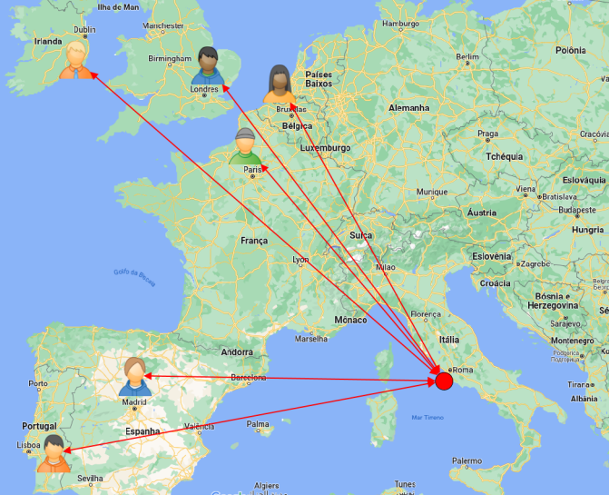
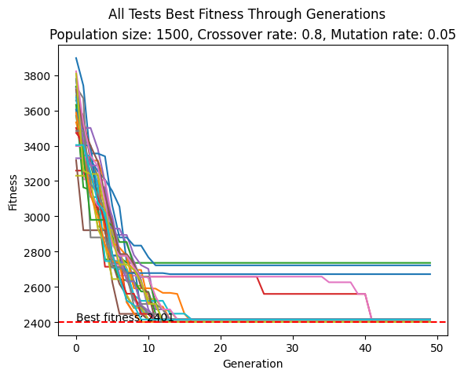

# Genetic Algorithm for Flight Schedule Optimization

## Description
This project implements a genetic algorithm to optimize flight schedules and ticket costs for a group of researchers traveling to a conference in Rome. The goal is to minimize the total waiting time at the airport and the cost of airfares.

## Features
- **Schedule Optimization**: Ensures that the arrival and departure times of flights are aligned to minimize waiting times.
- **Cost Minimization**: Searches for the most economical flight options, considering time restrictions.
- **Multiple Test Simulations**: Performs multiple tests to ensure the robustness and efficiency of the algorithm.

## Dependencies
- Python 3.8 or higher
- Additional Python libraries such as numpy and matplotlib for execution and visualization of results.

## How to Run
1. Clone the repository: `git clone https://github.com/ThaisBarrosAlvim/GeneticAlgorithm`
2. Install the dependencies: `pip install -r requirements.txt`
3. Run the main script: `python main.py`

## Visualizations

### Flight Map

### Performance Graph
The evolution of fitness over generations can be viewed in the following graph:

## License
Distributed under the MIT License. See `LICENSE` for more information.
